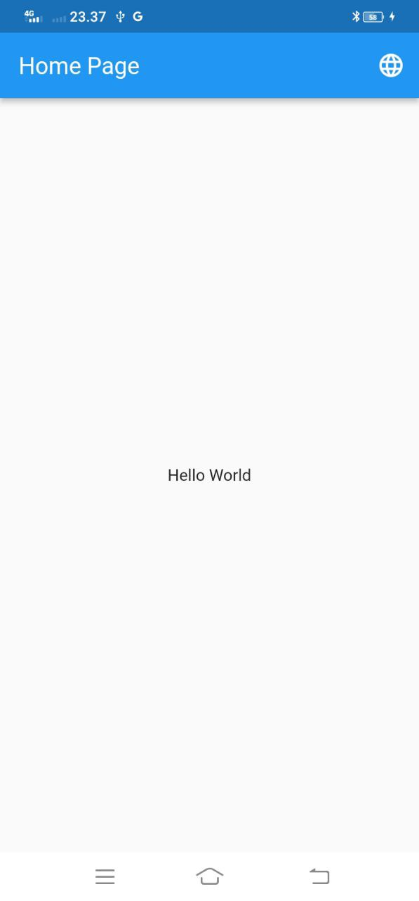

# Flutter localization ✨


# Introduction

Internationalizing Flutter apps with [GetX](https://pub.dev/packages/get)

In this example app, I will share a little bit what about Localization and Internationalization.

## Contents

- [Prerequisites](#Prerequisites)
- [What Internationalization and Localization]()
- [Why it is Important]()
- [When we use]()
- [How to implement in a Flutter Project]()
- [Used Languages](#Used-Languages)

# Prerequisites

If you are new to Flutter, please first follow the [Flutter](https://docs.flutter.dev/get-started/install) Setup guide.

# Internationalization

Internationalization is the process of designing and developing your application (webapp, mobile app, etc) in a form that can be adapted and localized to different cultures, regions and languages. [Official documentation](https://docs.flutter.dev/development/accessibility-and-localization/internationalization)

# Localization

Localization is the form that your application adapts to meet the language to some Locale.

# Implementation

- STEP 1 [Package]()
  - GetX
- STEP 2 [Translation]()
  - [LangClass](#Parse-Resource-Language)
  - Setup Locale
- STEP 3 [Update-Locale]()
  - [Change Language](#Update-Language)
- STEP 4 [Finishing]()
  - Implementation
  - Optimization Call Lang Data

# Usage

- <h2>Import the GetX package</h2>

Add to `pubspec.yaml`

```ts

dependencies:
  cupertino_icons: ^1.0.2
  flutter:
    sdk: flutter
  get: ^4.6.5

```

# Country codes List


- [Check here](https://www.nationsonline.org/oneworld/country_code_list.htm)

# Parse Resource Language

```ts
import 'package:get/get.dart';

class lang extends Translations {
  @override
  Map<String, Map<String, String>> get keys {
    return {
      'id_ID': {
        homePage: "Halaman Utama",
        bodyhomePage: "Hallo Dunia",
      },
      'en_US': {
        homePage: "Home Page",
        bodyhomePage: "Hello World",
      },
      'tw_TW': {
        homePage: "主頁",
        bodyhomePage: "你好世界",
      },
    };
  }

```

# Implementations to main

```ts
 return GetMaterialApp(
      // locale: const Locale('id_ID'),
      locale: Locale(Lang.locale.first.keys.first),
      translations: Lang(),

```

# Parse List Items

- <h3>Lang</h3>

```ts

class Lang extends Translations {
  static const List<Map<String, String>> locale = [
    {'id_ID': 'Indonesia'},
    {'en_US': 'English'},
    {'tw_TW': 'Chinese Traditional'}
  ];

  static const homePage = 'home_page';
  static const bodyhomePage = 'body_home_page';

```

# Update Language

- <h3>language_page</h3>

```ts

 body: ListView.builder(
          itemCount: Lang.locale.length,
          itemBuilder: (context, index) {
            Map language = Lang.locale[index];
            return ListTile(
              onTap: () {
                Get.updateLocale(Locale(language.keys.first));
              },
              title: Text(
                language.values.first,
              ),
            );
          },
        ),

```

# Implemntation

- <h3>Optimization Call Language</h3>

```ts

//  Text('home_page'.tr),
//  Text("body_home_page".tr),
title: Text(Lang.homePage.tr),
child: Text(Lang.bodyhomePage.tr),

```

- <h3>Add icon check for the language running</h3>

```ts

 title: Text(
                language.values.first,
              ),
              trailing: language.keys.first == Get.locale!.languageCode
                  ? const Icon(Icons.check)
                  : null,

```

# Screenshots result

   

# Used Languages

- [Indonesia](id)
- [English](US)
- [Chinese](TW)
